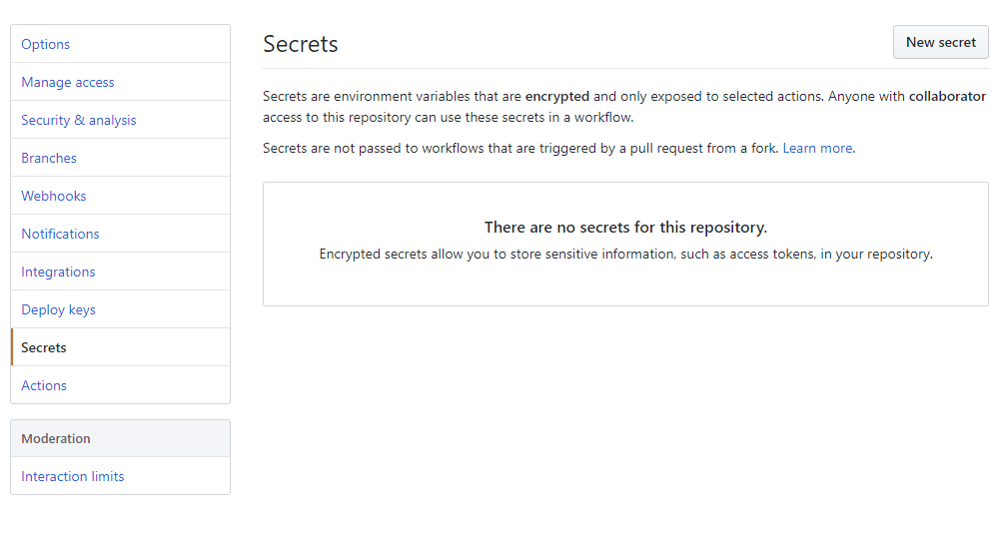
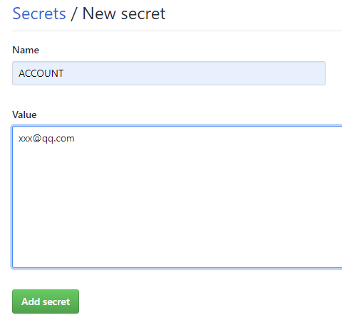
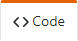
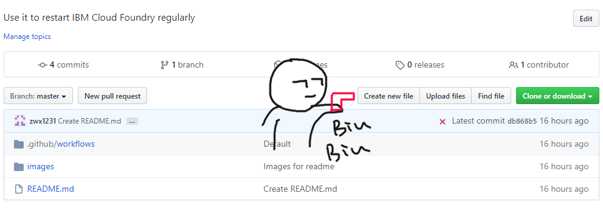
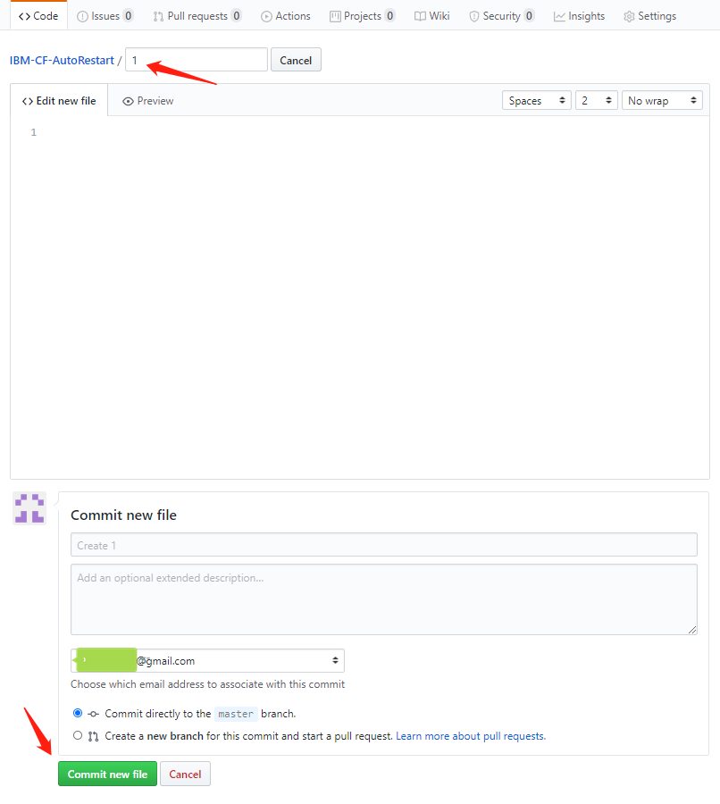
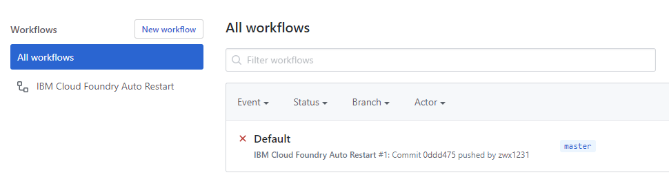
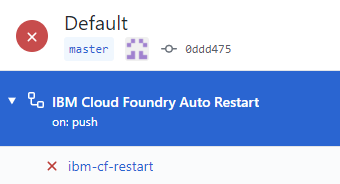
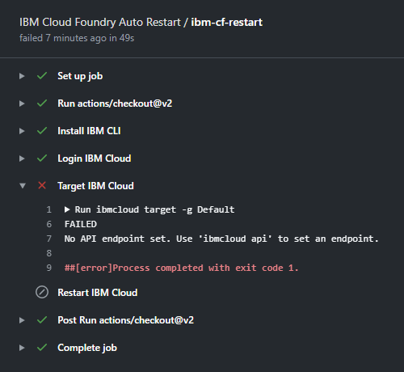

# IBM-CF-AutoRestart

Use it to restart IBM Cloud Foundry regularly

使用它定期重启你的 IBM Cloud Foundry


## Fork 本仓库

点击  右侧的  按钮


## 设置变量

点击项目下方最后一枚  按钮


选中左侧 Secrets 后右上角 点击 New secret ↓




在如下图的界面中添加变量 ↓




添加如下变量：

  ACCOUNT     ==>   IBM 账户邮箱

  PWD         ==>   IBM 账户密码

  REGION      ==>   Cloud Foundry 应用地区 (一般就是 us-south (达拉斯)

  与域地址是 us-south.cf.appdomain.cloud 还是另选了 mybluemix.net 无关

  APP_NAME    ==>   应用程序名, 区分大小写


## 激活 Actions

点击项目下方第一枚  按钮


Create new file 创建一个新的文件 ↓




随意输入一个文件名, 内容则可为空 ↓




接下来, 点击项目名下方第四枚  按钮


默认有一个叫 Default 的文件, 点击它 ↓




点击左侧 ibm-cf-restart ↓




如无意外 应该在 Target IBM Cloud 一栏停止 ↓




目光来到右上角Re-run all jobs即可 

### 跑起来吧！


#---#

## 一次重启多个账号的应用程序

修改Code栏此路径下的run.yml文件

- IBM-CF-AutoRestart/.github/workflows/

将下面两个步骤复制一份粘贴在尾部

```
$ - name: Login IBM CF
$   run: |
$     IBM_Cloud_CLI/ibmcloud login -u ${{ secrets.ACCOUNT }} -p ${{ secrets.PWD }} -r ${{ secrets.REGION }}
$
$ - name: Restart IBM CF
$   run: |
$     IBM_Cloud_CLI/ibmcloud target -g Default
$     IBM_Cloud_CLI/ibmcloud target --cf
$     IBM_Cloud_CLI/ibmcloud cf restart ${{ secrets.APP_NAME }}
```

修改 ACCOUNT, PWD, REGION, APP_NAME 四个变量的名称, name 名称后

设置新的 Secrets 与其对应即可

## 自定义时间

#### 本项目默认每周一 5:00am 执行IBM Cloud Foundry 的自动重启

修改Code栏此路径下的run.yml文件

- IBM-CF-AutoRestart/.github/workflows/

自定义第九行中的内容即可

```
$ - cron: '0 21 * * 0'
```

注: 该处采用 UTC 时间